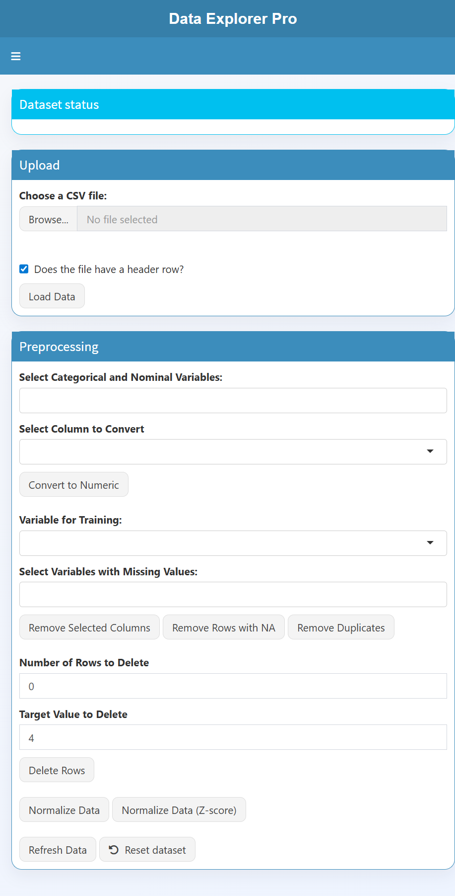

# DataExplorer R Shiny

Application Shiny en R pour explorer, visualiser et modéliser des données tabulaires à partir de fichiers CSV.

## Aperçu

Cette application propose un tableau de bord interactif pour :
- charger un dataset CSV,
- prétraiter les données,
- visualiser les variables et leurs relations,
- entraîner plusieurs modèles de classification,
- comparer leurs performances.

## Fonctionnalités

- Téléversement et prétraitement de données
- Visualisations interactives avec ggplot2 et plotly
- Analyse unidimensionnelle et bidimensionnelle
- Matrice de corrélation
- Entraînement de modèles : SVM, Random Forest et Régression logistique
- Visualisation des métriques, ROC curves et importance des variables
- Interface modernisée avec un thème business

## Captures d’écran

### Vue générale du dashboard



### Panneau de modélisation


## Installation

Prérequis :
- R 4.x
- RStudio ou un terminal capable d’exécuter R

Installez les dépendances :

```r
install.packages(c(
  "shiny", "DT", "dplyr", "ggplot2", "plotly", "e1071", "rpart",
  "psych", "corrplot", "caret", "pROC", "ROCR", "pdp", "randomForest",
  "shinyjs", "shinyWidgets", "shinydashboard"
))
```

## Lancer l’application

Depuis la racine du projet :

```r
shiny::runApp()
```

Ou depuis RStudio, ouvrez le fichier app.R puis cliquez sur Run App.

## Exemple de dataset

Le dépôt contient un fichier d’exemple :
- breast-cancer-wisconsin.csv

Vous pouvez l’utiliser pour tester rapidement l’application.

## Notes

L’interface intègre des actions de prétraitement utiles comme la suppression de colonnes/ lignes, la normalisation, la détection des doublons et le reset du dataset.
